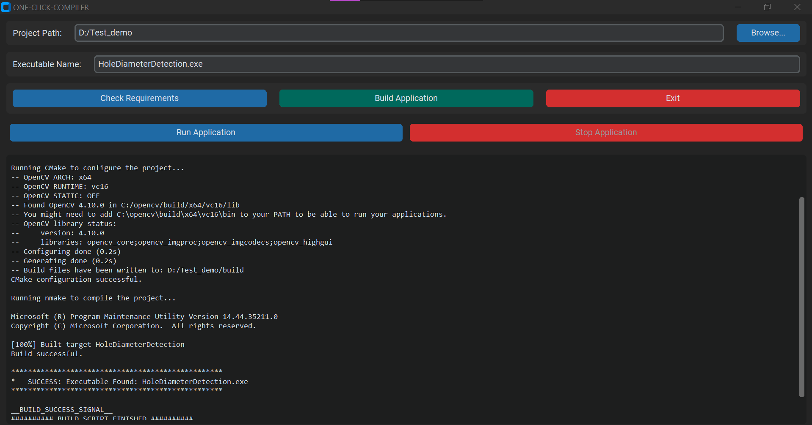
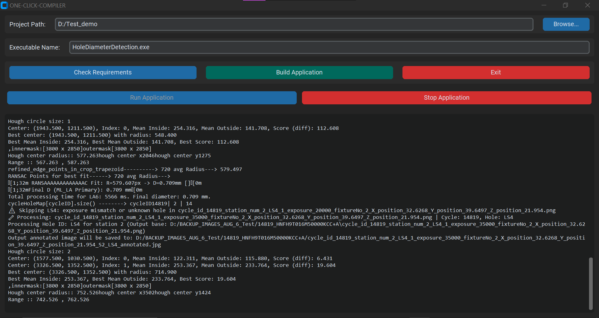
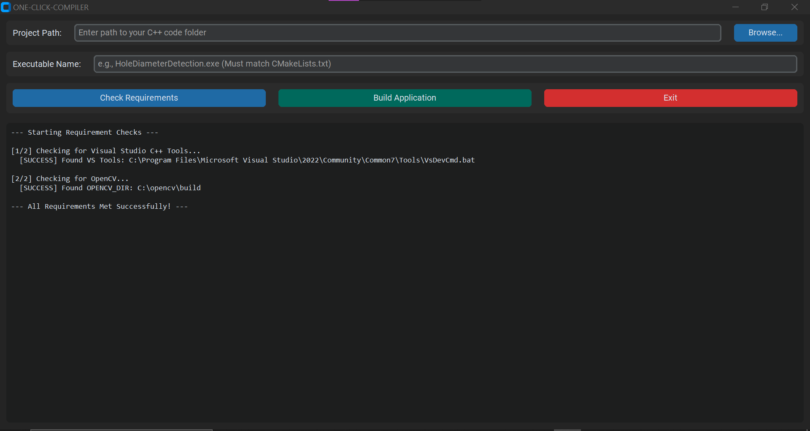

#   One-Click-Compiler


**One-Click-Compiler** is a graphical interface designed to make compiling, running, and testing C++ projects (with OpenCV) effortless.
It removes the need for command-line operations by offering a **single-window workflow** for building and executing projects using **CMake + NMake** in **Visual Studio 2022**.

---

## Table of Contents

1. [Overview](#overview)
2. [Features](#features)
3. [Prerequisites](#prerequisites)
4. [Installation](#installation)
5. [Running the Application](#running-the-application)
6. [Usage Guide](#usage-guide)
7. [Tips](#tips)

---

## Overview
<div align="center">
  <table>
    <tr>
      <td align="center">
        <br>
        <em>Example 1 – Build Process in Progress</em>
      </td>
    </tr>
    <tr><td><br></td></tr>
    <tr>
      <td align="center">
        <br>
        <em>Example 2 – Running a Compiled OpenCV Application'</em>
      </td>
    </tr>
    <tr><td><br></td></tr>
    <tr>
      <td align="center">
        <br>
        <em>Example 3 – Environment Check Results</em>
      </td>
  </table>
</div>

---

## Features

* **One-Click Build** – Compile your C++ project with a single click using CMake + NMake.
* **Environment Checks** – Quickly confirm that Visual Studio C++ tools and OpenCV are correctly configured.
* **Live Terminal Output** – Monitor compilation in real-time within the interface.
* **Run / Stop Controls** – Start or terminate your compiled program without extra steps.
* **Incremental Builds** – Only rebuild changed files, saving time on repeated builds.

---

## Prerequisites

Before installing, ensure the following are set up:

1. **Python 3** – [Download here](https://www.python.org/downloads/)

   > During installation, enable **"Add Python to PATH"**.

2. **Visual Studio 2022**

   * Install the **Desktop development with C++** workload.

3. **OpenCV**

   * Download from [OpenCV Releases](https://opencv.org/releases/)
   * Extract and set the environment variable:

     ```plaintext
     OPENCV_DIR = C:\opencv\build
     ```

---

## Installation

### Step 1 – Clone the Repository

```sh
git clone https://github.com/SARATH062005/One-Click-Compiler.git
cd One-Click-Compiler
```

### Step 2 – Install Dependencies

```sh
pip install customtkinter
```

---

## Running the Application

From the project directory, run:

```sh
python main.py
```

---

## Usage Guide

1. **Check Requirements (Optional)**

   * Click **Check Requirements** to verify your build environment.

2. **Select Project Path**

   * Choose the root folder containing your `CMakeLists.txt`.

3. **Set Executable Name**

   * Enter the exact `.exe` name generated by your CMake configuration.
     Example:

     ```
     HoleDiameterDetection.exe
     ```

4. **Build the Application**

   * Click **Build Application**.
   * Watch the live compiler output.

5. **Run or Stop the Application**

   * Use **Run Application** to start your program.
   * Use **Stop Application** to terminate it instantly.

---

## Tips

* The application remembers your last used project path and executable name.
* Always ensure your `OPENCV_DIR` environment variable points to the correct build folder.
* Incremental builds are faster after the first compilation.

---
<p align="center">
  ⭐ If you find this useful, please give it a star on GitHub! ⭐
</p>
